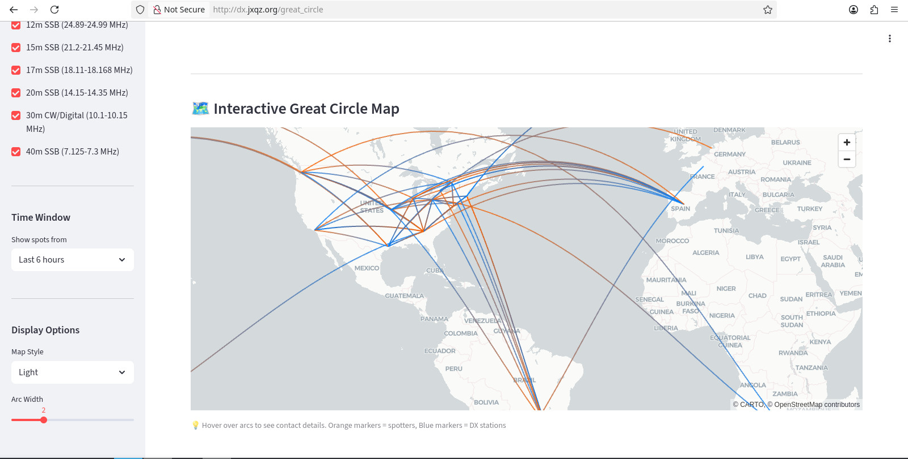

# Olympic College CS 330 Project

HF Radio Propagation Analysis and Prediction

**System Links**

* [Streamlit DX Analysis Dashboard](http://dx.jxqz.org)
* [Grafana System Status](https://jersey.jxqz.org:3000) note: self-signed SSL certificate in use
* [Database Query API](http://api.jxqz.org:8080)

## Overview

The software system consists of several different components, but the primary elements are a PostgreSQL database and
a web dashboard written in the [Streamlit](https://streamlit.io) framework. The major components are described in
greater detail in separate files linked below. Some of the key features of the system are:

* Continuous real-time data collection from the global DX server network
* HTTP/JSON query API with various filter paramters for analysis applications
* Web-based dashboard for desktop and mobile that shows real-time data and geospatial visualizations
* AI prediction of HF radio propagation for next 24-72 hours
* Real-time alerts of key indicator propagation events via SMS alerts
* Flexible and scalable deployment system for production environments
* System status monitoring via Prometheus and Grafana

### Major Components Documentation

* [PostgreSQL database](finalproject/database.md)
* [DX scraper daemon](finalproject/scraper.md)
* [API server](finalproject/api-server.md)
* [Dashboard](finalproject/dashboard.md)
* [SMS alerting](finalproject/sms-alerts.md)
* [Deployment infrastructure](finalproject/devops.md)
* [Monitoring](finalproject/monitoring.md)

## Homework

Five assignments comprise the iterations of the project.

* [Homework 1](homework1)
* [Homework 2](homework2)
* [Homework 3](homework3)
* [Homework 4](homework4)
* [Homework 5](homework5)

## References

* A Relational Model of Data for Large Shared Data Banks. [E.F. Codd 1970](https://www.seas.upenn.edu/~zives/03f/cis550/codd.pdf)
* Normalized Data Structure: A Model for Data Base Design. [E.F. Codd 1971](https://www.fsmwarden.com/Codd/Normalized%20data%20base%20structure_%20a%20brief%20tutorial%281971,%20nov%29.pdf)
* Database Design for Mere Mortals: A Hands-On Guide to Relational Database Design. 2nd Ed. Michael J. Hernandez
* SQL Queries for Mere Mortals: A Hands-On Guide to Data Manipulation in SQL. 3rd Ed. Michael J Hernandez, John Viescas
