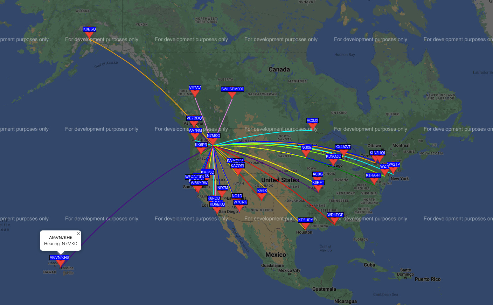

# cs330-projects

Olympic College CS 330 Homework and Project

## Homework

* [Homework 1](homework1)
* [Homework 2](homework2)
* Homework 3

## Proposed Project

HF Radio Propagation Predictor

## Reading

* A Relational Model of Data for Large Shared Data Banks. [E.F. Codd 1970](https://www.seas.upenn.edu/~zives/03f/cis550/codd.pdf)
* Normalized Data Structure: A Model for Data Base Design. [E.F. Codd 1971](https://www.fsmwarden.com/Codd/Normalized%20data%20base%20structure_%20a%20brief%20tutorial%281971,%20nov%29.pdf)
* Database Design for Mere Mortals: A Hands-On Guide to Relational Database Design. 2nd Ed. Michael J. Hernandez
