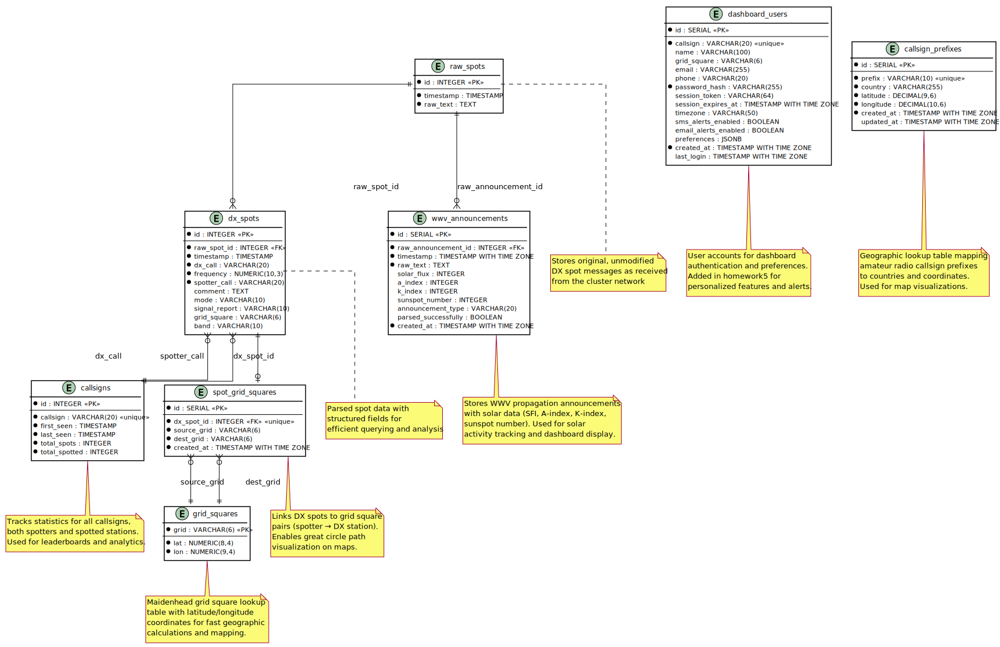

# DX Analysis Database

The PostgreSQL database schema consists of 7 tables in the *dx_analysis* database.

An [entity relationship diagram](plantuml/database_schema.puml) (ERD) was created with PlantUML.

## Tables

* *wwv_announcements*: solar data
* *callsigns*: station calligns, spot counts, timestamps
* *dx_spots*: parsed DX reports
* *raw_spots*: raw text from scraper with timestamps 
* *dashboard_users*: user login data for the dashboard 
* *grid_squares*: grid square coordinates (lat/lon)
* *callsign_prefixes*: callsign prefix coordinates (lat/lon)
