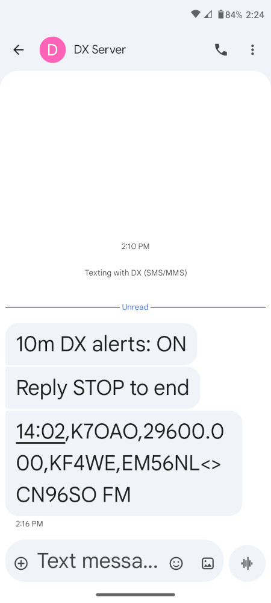
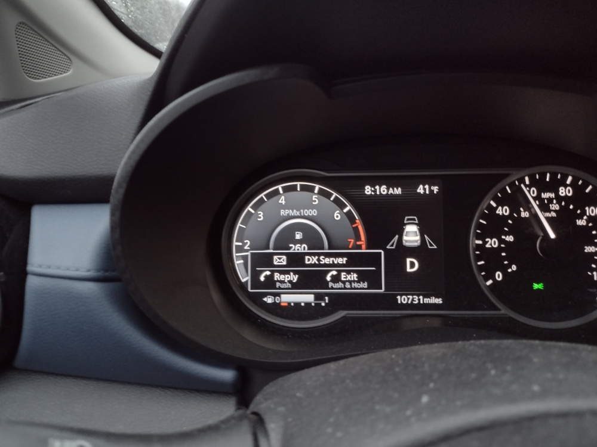
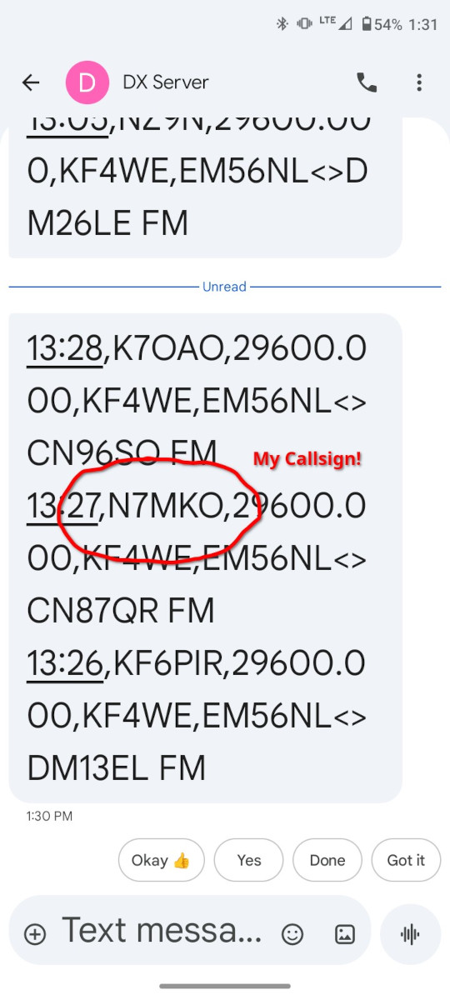

# DX SMS Alerts

During the development of the dashboards, it occurred to me that I might like to have some real-time alerts
for significant events or conditions that I like to turn on the radio for. I decided to create a simple alert
for 10 meter FM spots. When there is activity on 29.600 Mhz FM, I can almost certainly turn on the radio in the
car and talk across the country and probably hear other continents as well. It is sort of a bellweather as to
what the overall conditions are. It is not a guarantee since 10m can exhibit shorter distance propagation without
global paths ebing open, but it is still an event of interest.

As a proof of concept I created a [simple shell script](../homework5/cron-alerts/alert-10fm.sh) that runs 
a [SQL query](../homework5/cron-alerts/10fm-fm.sql) every fifteen minutes [via cron](../homework5/cron-alerts/crontab.user.txt). 
Any 10m FM spots from the past 15 minutes will be sent via email and/or SMS message. Email is sent directly from the server, while SMS messages
are sent through the [SMS API](https://voip.ms/rources/api) at [voip.ms](https://voip.ms) where I have a DID phone 
number. I prefer the SMS alerts to email because they don't clutter my inbox and most importantly, they integrate 
with my car's bluetooth system. I can see them pop up on my instrument panel and have them read to me. 

The alerts are currently configured to run from 8am to 6pm so they are not disruptive. They can be enabled and
disabled through the web dashboard. I hope to expand this functionality in the future. Also, the server has the
ability to process commands received over SMS using a callback such as stop/start.

This past weekend I received several of these automated alerts and drove to one of my usual hilltop parking
spots and talked to someone in Tennessee. Ten minutes later I got an alert for my own callsign, which had
been spotted on the network and then sent to me in an automatic alert (see third image below). Aha it works!

