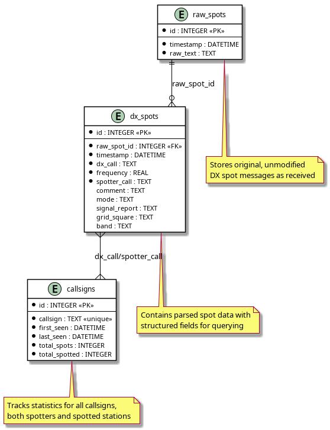

# CS 330 Homework 1 : Getting Started

The goal of this assignment is to set up an AI-powered development environment and begin the process of final project planning.

## Development Environment

Lenovo T440p laptop

* Intel(R) Core(TM) i5-4300M CPU @ 2.60GHz
* 8GB RAM
* Debian 12
* Python 3.11
* Visual Studio Code & Vim for editing
* Sqlite3 and PostgreSQL for databases

## AI Agent

Currently using Visual Studio Code on Linux with Claude Sonnet 3.5, but am experimenting with other chat agents as well.

I also have been using Microsoft Copilot for a few months for general information on topics I am studying. I also will
generate oocasional code snippets there as well that I cut and paste into a terminal or whatever I am working on.

## Python and Test Models

These are the steps I went through to get Python and necessary libraries installed on my computer for getting the Gemma
models running via the Hugging Face transformers library. In the past, I have tended to install Python libraries through
the **Debian apt** as much as possible. I used *pip* occasionally, but just installed packages locally for my user. Now it
seems Debian is requiring all *pip* installations to be in a virtual environment (venv) so I am adapting to using the venv
for everything. I tend to do some amount of testing in the terminal, because I am used to it. However, I will be trying to
use VSCode as much as possible. 

Activate my python virtual environment with command. Can alias in shell as 'sv' or something.

```
source ~/cs330_venv/bin/activate
```

### Sentiment-analysis / Gemma Models

1. Created Hugging Face Account
2. Accepted Gemma License Agreement
3. Reviewed [gemma-3-270m model description](https://huggingface.co/google/gemma-3-270m) on Hugging Face. Can be used via libraries (transformers), notebooks, or local apps.
4. Created Hugging Face Access token (read token) stored in [.env file](dotenv.template). Create .gitignore and ignore credentials, etc.
5. Created [basic sentiment-analysis script](hf_simple.py) with the AI agent to verify Hugging Face access.
6. Script did not run, needed to create python venv on Debian 12 and pip install transformers and torch (lots of dependencies).
7. With basic script running, I had my agent create a [gemma_test.py](gemma_test.py) script.
8. Had AI angent (Claude Sonnet) modify script to add ability to specify text prompt on command line.
9. Asked agent to save [a transcript of a chat session](chat-transcripts/chat-conversation.md) in a Markdown file.
10. Gave the small Gemma model several prompts. The output seemed repetitive and not very coherent. I did some research on this and found a number
of articles [such as this](https://medium.com/nlplanet/two-minutes-nlp-most-used-decoding-methods-for-language-models-9d44b2375612) that describe all the
different parameters that can be adjusted to produce more coherent text generation. I would like to look at this more as time permits.

### Example Program Output

#### Sentiment Analysis Script Output

<pre>
(cs330_venv) steve@kitsap:~/GITHUB/cs330-projects/homework1$ ./hf_simple.py 
No model was supplied, defaulted to distilbert/distilbert-base-uncased-finetuned-sst-2-english and revision 714eb0f (https://huggingface.co/distilbert/distilbert-base-uncased-finetuned-sst-2-english).
Using a pipeline without specifying a model name and revision in production is not recommended.
config.json: 100%|█████████████████████████████████████████████████████████████████████████████████████████████████████████████████████████████████████████████████| 629/629 [00:00<00:00, 2.54MB/s]
model.safetensors: 100%|█████████████████████████████████████████████████████████████████████████████████████████████████████████████████████████████████████████| 268M/268M [00:24<00:00, 10.9MB/s]
tokenizer_config.json: 100%|██████████████████████████████████████████████████████████████████████████████████████████████████████████████████████████████████████| 48.0/48.0 [00:00<00:00, 226kB/s]
vocab.txt: 232kB [00:00, 6.14MB/s]
Device set to use cpu
[{'label': 'POSITIVE', 'score': 0.9971315860748291}]
</pre>

<pre>
(cs330_venv) steve@kitsap:~/GITHUB/cs330-projects/homework1$ ./hf_simple.py "I think this ham radio antenna is mediocre at best"
No model was supplied, defaulted to distilbert/distilbert-base-uncased-finetuned-sst-2-english and revision 714eb0f (https://huggingface.co/distilbert/distilbert-base-uncased-finetuned-sst-2-english).
Using a pipeline without specifying a model name and revision in production is not recommended.
Device set to use cpu
[{'label': 'NEGATIVE', 'score': 0.9997625946998596}]
</pre>

#### Gemma Model Script Output

<pre>
(cs330_venv) steve@kitsap:~/GITHUB/cs330-projects/homework1$ ./gemma_cmdline.py "write a horoscope for capricorn"
Device set to use cpu

Generated text:
write a horoscope for capricorn
Capricorn has a unique way of thinking. He is a very logical and analytical man. He is very good at making decisions and taking the right decisions. He is very good at thinking out a plan. He is very good at making decisions and taking the right decisions. He is very good at making decisions and taking the right decisions. He is very good at making decisions and taking the right decisions.He is a very good at making decisions and taking the
</pre>

<pre>
(cs330_venv) steve@kitsap:~/GITHUB/cs330-projects/homework1$ ./gemma_cmdline.py "The Olympic mountains in Washington are a hiker's paradise"
Device set to use cpu

Generated text:
The Olympic mountains in Washington are a hiker's paradise. They are the world's highest mountain ranges, and some of the world's most incredible scenery. The Olympic Mountains are located in the Cascade Range, which is the highest mountain range in the United States. The Olympic Mountains are located in Washington State, which is a small state in the U.S. of A. There are some major trails in the Olympic Mountains, including the Olympic Mountains Trail, the Olympic Mountains Wilderness Trail,
</pre>

**Steve's notes on the above**

Calling a language model has two steps: tokenizing and inference.

Models can't operate on words, so the tokenizer converts text into a list of numbers. A token is either a word or a part of a word.

Inference can then be performed on this list (vector) of numbers.

## Database Setup

"Nouns make good tables."

```
sudo apt install postgresql sqlite3
```

### Sqlite Test

<pre>
steve@kitsap:~/GITHUB/cs330-projects/homework1$ echo 'SELECT "Steve Test", sqlite_version(), pow(2, 8);' | sqlite3
Steve Test|3.40.1|256.0
</pre>

### Postgresql Test

TODO

<pre>
(cs330_venv) steve@kitsap:~/GITHUB/cs330-projects/homework1$ psql
psql: error: connection to server on socket "/var/run/postgresql/.s.PGSQL.5432" failed: FATAL:  role "steve" does not exist
</pre>

## Project Planning 

My favorite hobby is ham radio. I would like to develop an AI model to predict worldwide high frequency (HF) radio propagation. 
Traditional HF propagation programs have relied on solar data for their predictions. For example, the popular W6ELprop program
uses something called the Solar Terrestrial Dispatch (STL) model. I would like to take a difference approach based on the observation
that certain propagation trends tend to persist for a period of time. It is not guaranteed that propagation at 28 Mhz will be good tomorrow
because it was good today, but it probably will. I think these types of probabilistic radio phenomena may be well-suited to prediction
by a machine learning model. I would like to explore this possibiliy in my project.

## Data Set

Solar data is plentiful and publicly available. I definitely want to keep it in mind, but for now I think I would like to focus on data that
is in general referred to as DX spots. The DX (or distance) spots are human-created or automated reports of radio transmissions that are received
by a listening station, along with information about their origin. Regardless of how the data are created in a reporting system, the result is
that an arc connecting two points on the globe can be determined such that a radio wave propagation path is identified between the two points.
Additional information such as signal strength may be included in the reports as well. These reports are collected by various networks or 
dedicated web sites for the purpose of providing real-time reporting of conditions and stations operating. I would like to collect some of 
this data and use it to make predictions about future propagation conditions for the coming days or weeks. 

### Data Sources

There are a few different sources of real-time propagation report data I might be able to scrape. These include:

* [DX Cluster network](https://www.dxcluster.info) 
* [Reverse Beacon Network](https://www.reversebeacon.net)
* [PSK Reporter](https://pskreporter.info)

I am going to start with the DX Cluster network because I have been occasional user of this sysem since the 1990s. 

I started writing a Markdown file on the DX Cluster Message Format. Then I thought, "Why am I doing this? I can have my agent do it." Saved
endless amounts of time and the results are better.

* Steve's [DX Cluster Markdown file](docs/dx-cluster.md)
* AI Agent [DX Cluster Markdown file](docs/dx-cluster-info.md)

### Data Collector Script

I had my agent create [dx-cluster.py](dx-cluster.py) script to connect to a DX cluster node, read lines, and store them in a table.

This script seemed to be a little flaky when I tried to leave it running on my server, so I asked the agent for a simpler version
called [dx-cluster-file.py](dx-cluster-file.py) that just stored the lines to a text file. The plan being to ingest them later
into the database. I left this running on my server with the command listed below:

<pre>
jersey% nohup ./dx-cluster.py &
[1] 1169999
jersey% nohup: ignoring input and appending output to 'nohup.out'
</pre>

I am also considering setting up my own DX cluster node to more reliably collect data if this does not work well.

Note 10.01.2025: There may be a limit as to how long a client can stay connected to the DX cluster. Need to make data collection more robust.

Daily files are available at: http://jxqz.org/~steve/dx-data/

### Database Schema

I asked my AI agent to set up a database, but not sure how good the result is.

Would like to do a litle of my own manual design as well, just to get the hang of it.

Asked for [Plant UML diagram](dx_database_schema.puml). Not too good.



### Initialize database and load a day of collected DX spots

<pre>
steve@kitsap:~/GITHUB/cs330-projects/homework1$ ./init_dx_database.py 
Initializing DX cluster database in dxcluster.db...
Successfully initialized database schema in dxcluster.db
Database initialization complete.
steve@kitsap:~/GITHUB/cs330-projects/homework1$ ./load_dx_spots.py 
Loading DX spots from dx_spots.txt into dxcluster.db...
Processed 100 spots...
Processed 200 spots...
Processed 300 spots...
Processed 400 spots...
Processed 500 spots...
Processed 600 spots...
Processed 700 spots...
Processed 800 spots...
Processed 900 spots...
Processed 1000 spots...
Processed 1100 spots...
Processed 1200 spots...
Processed 1300 spots...
Processed 1400 spots...
Processed 1500 spots...
Processed 1600 spots...
Processed 1700 spots...
Processed 1800 spots...
Processed 1900 spots...
Processed 2000 spots...
Processed 2100 spots...
Processed 2200 spots...
Processed 2300 spots...
Processed 2400 spots...
Processed 2500 spots...
Processed 2600 spots...
Processed 2700 spots...
Processed 2800 spots...
Processed 2900 spots...
Processed 3000 spots...
Processed 3100 spots...

Spots processing complete:
Successfully processed: 3140
Skipped: 0
</pre>

### Descriptive Statistics and Simple Analytics

<pre>
steve@kitsap:~/GITHUB/cs330-projects/homework1/analysis$ ./analyze_dx_spots.py --db ../dxcluster.db 

=== Basic dataset summary ===
Total spots: 13119
Unique DX calls seen: 4301
Unique spotter calls: 3058
Time range: 2025-09-30 14:56:58 -> 2025-10-03 14:34:58 (2 days)
Average spots per day: 6559.50

=== Top spotted DX calls ===
V6D           636
DD4U          239
IQ9BH         226
II0IARU       195
II6IARU       157
IQ8TJ         139
IQ3QR         139
IT9ECY        124
A52G          120
IQ9BF         115

=== Top spotter calls ===
OH0M-44       289
KA9UVY        116
FM4TI         103
VK2JJM        102
YB1HR         96
LU6YR         95
UR2680SWL     93
IZ8VDZ        83
JR6RRD        75
IK2MLV        70

=== Band distribution (top) ===
40m    3389
20m    2767
10m    1866
6m      985
80m     902
15m     790
17m     636
30m     621
2m      367
12m     340

=== Mode distribution (top) ===
FT8     2643
SSB      995
CW       632
RTTY     355
FT4      217
USB      188
LSB      149
PSK        9

Busiest hour (UTC): 16:00 with 946 spots
</pre>
