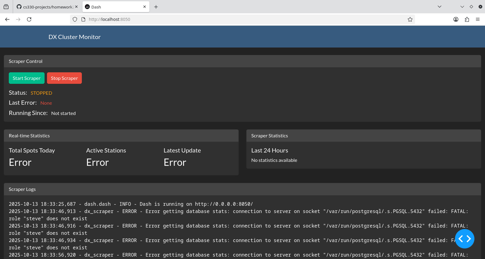

# CS330 Homework 2 Project Development

My goal in this iteration is to move the project from a proof-of-concept/prototype stage to a pre-alpha working system deployed into a production environment.

## Initial list of features for this iteration

These are the list of features or goals that I have considered for implementing. I will preserve this to-do list here and then document the work in a section below.
Anything remaining will need to be pushed to the next iteration or re-factored.

* Configure DNS with server name: dx.jxqz.org
* Configure Apache Web Server to support this virtual host.
* Install Postgres server into production environment and configure users and access control.
* Migrate (or create) database schema for Postgres.
* Rewrite the dx cluster scraping program to have:
   * Fault tolerance and error handling
   * Stop, Start, Status Control interface for the web API to hook to
   * Logging of status error conditions to syslog or similar
   * Options for: raw storage of data to text file or database insert
   * Packaging and Deployment mechanism
* Initial pass of a Web UI control panel in the style of a monitoring dashboard (for now)
* Updated Schema Documentaion
* Chat Logs and the Usual
* SQL quick reference and study guide
* Consider a deployment strategy: packages, containers, etc?
* CI/CD pipline and automated testing?

## Development Tasks

### DNS Configuration

A CNAME record for dx.jxqz.org was added to my DNS configuration in my [domain registrar](www.porkbun.) portal.

### Configure Apache virtual server

I have an existing Linux virtual machine that runs my website. I [asked Copilot](chat-transcripts/apache2-chat.md) to create
an [Apache2](https://httpd.apache.org/docs/2.4) config file [dx.jxqz.org.conf](config/dx.jxqz.org.conf) to create another virtual 
server for this project. I followed the instructions listed in the [chat transcript](chat-transcripts/apache2-chat.md) to manually
install the file and restart the server. Tested. The site dx.jxqz.org loads successfully with an empty directory listing.

### Postgresql production install and config

Used *sudo apt install postgresql* to install postgres on the production server.

I [asked Copilot](chat-transcripts/db-roles.md) to help me move the postgres version of my scripts to the curreny directory and create roles for the various programs that will connect to the RDBMS server.

### Initial Web UI Creation

I chatted with copilot and asked about the best UI frameworks for data science type projects.

---

**Given your preferences—Python-based, no notebooks, real-time data, and predictive AI models—here are the top UI frameworks that best suit your needs:**

### ⚡ Best Python UI Frameworks for Real-Time AI Dashboards

| Framework     | Strengths for Your Use Case                                      | Ideal For                                      |
|---------------|------------------------------------------------------------------|------------------------------------------------|
| **Dash**      | Highly customizable, supports real-time updates, integrates well with Plotly and Flask | Production-grade dashboards with complex UI    |
| **Streamlit** | Fast prototyping, simple syntax, supports real-time widgets and model outputs | Lightweight apps and quick deployment          |
| **Panel**     | Flexible layout, supports multiple plotting libraries, good for streaming data | Multi-visual dashboards with PyData stack      |
| **Reflex**    | React-powered Python framework, great for dynamic UIs and state management | Modern, reactive apps with real-time interactivity |
| **Gradio**    | Ideal for ML model demos, supports live inputs and outputs       | Sharing AI models with interactive interfaces  |

### 🧠 Recommendation Based on Your Needs
- **For real-time predictive AI models**: **Dash** and **Reflex** offer the most control and scalability. Dash is mature and enterprise-ready, while Reflex is newer but React-powered for dynamic UIs.
- **For simplicity and speed**: **Streamlit** is excellent if you want to get up and running quickly with minimal code.
- **For multi-library support**: **Panel** is great if you're using tools like Bokeh, Matplotlib, or Holoviews.

Would you like help scaffolding a starter dashboard with one of these frameworks?

---

Based on these recommendations I [asked Claude Sonnet 3.5](chat-transcripts/web-ui-transcript.md) to create me a basic web application framework. I then
went about installing the dependencies and attempting to get the system up and running in the "production environment" and on my laptop in some for as well
for testing and further development.

I started with the testing environment. I have not previously worked with [Python WSGI](https://en.wikipedia.org/wiki/Web_Server_Gateway_Interface) so I will need to read up on it. However,
I have used CGI and mod_python previously for extremely simple tasks.

I modfied the apache2 config file to use an alternate name for the test/dev server: dxdev.jxqz.org. I created an entry in my local /etc/hosts file for this hostname resolving to 127.0.0.5.

*sudo a2ensite dxdev.jxqz.org ; sudo systemctl reload apache2*

#### WSGI and Python Dependencies

I need install dependencies in my development virtual environment. Looks like the updated [apache2 config for WSGI](config/dx.jxqz.org.conf)
will attempt to run out of my venv and git repositing which is fine for now. 

```
source ~/cs330_venv/bin/activate
```

Now I can install my [python dependencies](requirements-web.txt).

```
pip install -r requirements-web.txt
```

Result: lots of packages downloaded and installed successfully.

First attempt to start the server and web app was not successful. Getting permissions errors. Had to do some manual edits on apache config like setting venv path.

Update: After hacking on this for about an hour and a half [it is clear](docs/wsgi-error.txt) that the AI generated Apache2 config and instructions are not going to be enough to get this
running. I am going to have to dig into the Python [mod_wsgi documentation](https://www.modwsgi.org/en/develop/user-guides/virtual-environments.html). Hopefully, I 
will only have to do this once and then my development and production environments will be set up for the remainder of the project. 

**Apache / mod_wsgi setup steps**

1. Install apache2, libapache2-mod-wsgi-py3 dpkg
2. Create venv that will be used by the python wsgi instance for this application
3. Create a DocumentRoot for the application
4. Create an apache site configuration file for the virtual host
5. Check directory ownership, permissions, and other gotchas
6. ~~Enjoy your new application~~
7. Get an internal server error that suggests something wrong with python venv or app code.
8. Try to get my dash app to run as a standalone python program and come back to apache/mod_wsgi later.

#### Dash & Streamlit: I need to learn a bit. My AI is not turnkey it seems.

Now that my AI-generated Python [Dash](https://dash.plotly.com/) app doesn't seem to be working out of the box, I need to take
a step back and learn a thing or two about the Dash framework. I may also try to do something in [Streamlit](https://streamlit.io/)
if Dash becomes a huge time sink.

Why don't I ask Claude to help me get it running locally!

Yup: Claude [found a compatibility issue](chat-transcripts/debug-chat.md) between numpy and pandas and fixed it. 



Got it running locally. Will do more testing on my laptop and them figure out the deployment.

Also, I am out of free Github Copilot chats, so I have to go get more quarters to put in the machine. **Done: upgraded to subscription**

#### Testing Apach mod_wsgi with a simple example

A simple [flask Hello World](flask-test/app.py) from Microsoft Copilot.

```
sudo apt install python3-flask
```
<pre>
steve@kitsap:~/GITHUB/cs330-projects/homework2$ python flask-test/app.py 
 * Serving Flask app 'app'
 * Debug mode: off
WARNING: This is a development server. Do not use it in a production deployment. Use a production WSGI server instead.
 * Running on http://127.0.0.1:5000
Press CTRL+C to quit
127.0.0.1 - - [15/Oct/2025 18:47:41] "GET / HTTP/1.1" 200 -
</pre>

Can Apache run it?

With a little [help from Claude Sonnet 4](chat-transcripts/wsgi-test.md), my new upgraded Copilot, it is working.

#### Back to local testing of the Dash App

Now that I am upgraded to Claude Sonnet 4, I am making better progress. I [asked Claude](chat-transcripts/localtest.md) to help get the Dash
App up and running again locally, which was successful. I like the ability to start and stop scrapers from the App, but I think for now I would
like to get the scraper running via *systemctl* so I can just get consistent data flowing into the database independent of any of this other stuff.
That is my next goal. I also need to get the schema loaded on the production server and passwords configured, etc.

First I had to ask Claude to [consolidate scraper scripts](chat-transcripts/scraper-merge.md) so I can scrape from the live cluster. It gave
me a new [scraper README file](DX_LIVE_MONITOR_README.md).

**debugging/fixing**

Need to set password for dx_scraper that has role dx_writer.

<pre>
postgres=# ALTER USER dx_scraper WITH PASSWORD 'dxdevtest' NOSUPERUSER;
</pre>

More errors:
</pre>
  -> Committed 0 spots to database
03:19:24 | DX de K1BZ:       7021.6  N3JT         CWops CWT Contest              0319Z
Database error storing spot: permission denied for table raw_spots
</pre>

I am running into some issues with roles/permissions that were created by co-pilot. Need to check if they are loaded
correctly and such. I need to pause a second and revisit [Postgres documentation on users and roles](https://www.postgresql.org/docs/current/user-manag.html).

I also need to create a little [Postgres command reference](docs/postgres-commands.md) for my commonly used commands.

TODO: data explorer

TODO: research React Ecosystem, webGL libs, etc.

TODO: requirement.md file to guide Claude?

TODO: alerting infrastructure

### Addendum

In additiona I have spent some time [chatting wth AI] and reading about the foundational theory of relational databases and the
work of [E.F. Codd](https://en.wikipedia.org/wiki/Edgar_F._Codd). In my early days of programming, relational databases did not 
make much sense to me because I had little or no exposure to discrete mathematics and set theory. Now I have a stronger math
background and it makes sense.
