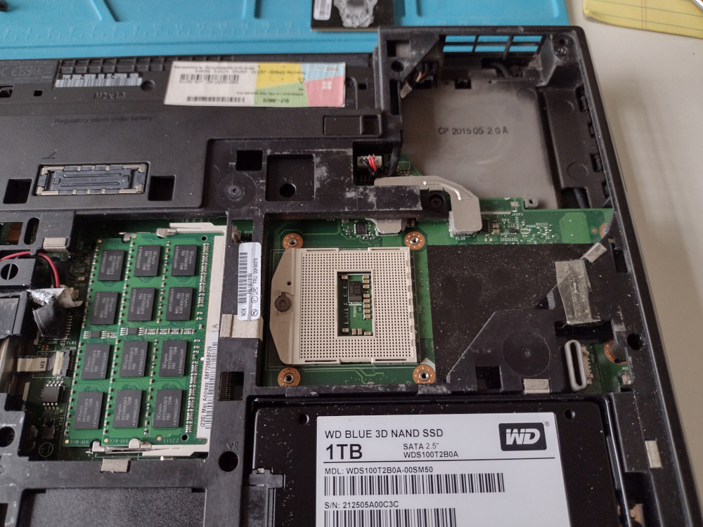

# CS 330 Homework 5

This file is maintained by Steve and is not to be modified by Github AI Copilot.

## System Links

* [DX Analysis Dashboard](http://dx.jxqz.org:8000)
* [API Server](http://api.jxqz.org:8080)
* [Grafana Monitoring](https://jersey.jxzq.org:3000)

## Tasks Completed

### Site Reliability / Debugging / Monitoring

At the end of the last iteration, I began to experience reliability problems with the DX cluster
scraper. The daemon process would occasionally hang and had to be restarted. I lost several days of 
data when I went out of town and couldn't keep a close eye on the server. It was difficult to know
exactly what was happening, but I knew that the production server was very resource constrained because
it was an old VM instance with little RAM and CPU because it had been serving only the lightest of loads
for years.

I decided to instrument the scraper with Prometheus and store performance metrics in a Prometheus time-series
database. This allowed me to use Grafana to visualize not only the performance of the scraper, but the
host OS and PostgreSQL as well. SSL was configured on Grafana with a self-signed certificate because it 
uses password logins. A simple Grafana dashboard was created just to keep an eye on things. I can add to it
in the future as needed.

I also had to add a Postgres user for Grafana to monitor the relational database.

Prometheus-node-exporter had to be installed in order for Prometheus to scrape the Linux host. Prometheus
has to be configured to scrape this (and the dx cluster client script as well).

I did some work to free up disk space on the production server, but in the end I simply scaled the virtual
machine instance to the next largest compute size. It immediately solved my low disk space problem and gave 
me enough memory for the system to run smoothly. I had been running the dashboard on a separate virtual 
machine, but my goal is to unify the stack on one system and just scale that machine as needed.

### Hardware Upgrade

My laptop is old and was really struggling at the start of the quarter with some of the development tools and
ML examples. I doubled the RAM from 8GB to 16GB last month and I finally got the CPU 
installed: Intel(R) Core(TM) i7-4712MQ CPU @ 2.30GHz, which doubles my cores and threads. 
I previously had a Core i5.

### Dashboard Overhaul

As of 12/1 the dashboard component of the project is in total crisis. I am having to institute emergency
project management triage. I am going to have to use the most powerful Github Co-Pilot models available
for this rescue operation. This first drastic step is to have the dashboard query the Postgres database 
directly. This will require all containers to run directly on that same server, which is fine for now.
The API server takes time to modify and deploy and I need to iterate quickly on this dashboard with
the simplest connection to the data as possible. I have also temporarily removed the ML model from the
dashboard because I need to focus on core features.

We created a [user login table](db_migrations...) and added this to the production database. I want
to be able to have persistent storage of my login and user config.

I want alerting.

## Todo

* Get dashboard updated
* Connect directly to DB
* Persistent Login, remember settings!
* Alerting
* Commit Prometheus config to github
* ML model

## Done

* Upgraded Production host VM instance in Vultr --> 25 GB disk & 1 GB RAM
* Installed Grafana for monitoring and configured SSL
* Installed Prometheus time-series database
* Database migration for Grafana Postgres user
* Install 
* Sysadmin work to free up space on production server root partition
* Scale instance in Vultr

---

## References

* Database Design For Mere Mortals
* SQL Queries For Mere Mortals
* DB Internals
